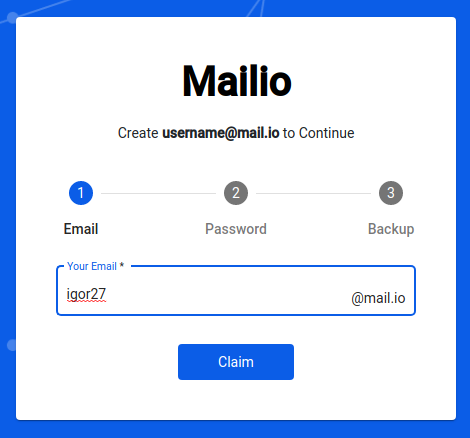
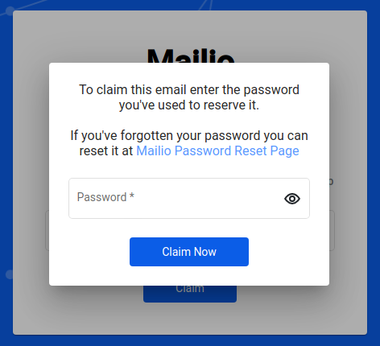

# How to

## Claim your reserved email

Visit [Mailio registration page](https://mail.io/register) [Registration](https://mail.io/register){: .md-button .md-button--primary}

Enter your reserved email (username). `Claim` button appears if the email was reserved prior to Public beta release.

Enter your password used to reserve the email alias.

If you've forgotten the password you've used to reserver the mailio email click on the `Mailio Password Reset Page` or click here: [Forgot password](https://mail.io/claimpassword){: .md-button .md-button--primary}

Otherwise click `Claim Now`. 

Read how to securely backup your **[Mailio Emergency Kit](/smartkey/#how-to-safely-backup-your-mailio-emergency-kit)**

!!! warning "Important"
    Don't lose your Mailio Emergency Kit. We don't store your passwords or private keys so restoring an account is impossible. Follow the backup instructions for your Emergency Kit. 

## Change your password

Once you're registered you may want to change your `Smart Key` password time to time. Smart Key is a part of `Mailio Emergency Kit` package. 

For changing your password you'll need:

1. Mailio Emergency Kit
2. Unzip the kit into a folder on your computer
3. Locate and open the file ending with `.pdf` (named something like `recovery_youremailalias@mail.io.pdf`)

The PDF document contains 24 backup words sometimes refered to them as `mnemonics`. 

Visit the Mailio recovery page: `https://mail.io/recovery`. 

Enter your 24 words as they appear in the PDF document and click `Next`. 

A popup will appear where you'll enter your email alias and choose a new password. 

After completing the form click on `Download SmartKey`. Make sure your email alias matches the Smart Key.

!!! info "Please wait"
    Please give it a moment until your new Smart Key is created. A cryptographic function may take a bit longer depending on your computer. 

`Download SmartKey` button will change to `Finish` button after which Mailio installs your new SmartKey into a browser storage and redirects you to your Inbox. 

## Restore forgotten password

The process of restoring a forgotten password is the same as changing your password. Please follow the instructions for how to **[Change your password](/howtos/#change-your-password)**

