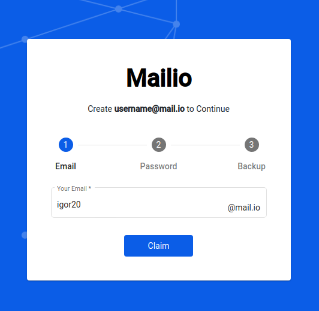

# Getting Started

## How do I register?

[Register here](https://mail.io/register){: .md-button .md-button--primary}

1. Click on the registrer button above select your desired email and click `Next`. 

2. Create your password. Make sure you create a strong password that you'll rememeber. 

3. Click the `Download` link and store the `Mailio SmartKey` file to your local computer. 

!!! warning
    [Make sure you checkout how to store and handle your `Mailio SmartKey` securely](smartkey.md).

## Claim your reserved Mailio address

This section applies to `gold`, `silver` and `bronze` users as well as everyone who has claimed their Mailio email. If you don't know what that means you can simply navigate to [https://mail.io/register](https://mail.io/register) and create your new email address. 

!!! quote "Reserved email addresses"
    If you've reserved an email already you need to claim it

In your browser navigate to [Registration](https://mail.io/register){: .md-button .md-button--primary}

Insert the email you've reserved (example: `igor20`):

> If the entered email was reserved, then `Claim` button should appear, otherwise check your reserved Mailio email.

Click on the `Claim` button and insert your password you've used when you've reserved your email.

Follow the rest of the registration process.

!!! warning
    [Make sure you checkout how to store and handle your `Mailio SmartKey` securely](smartkey.md).

