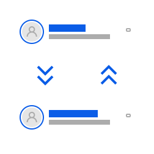
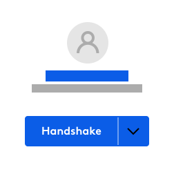
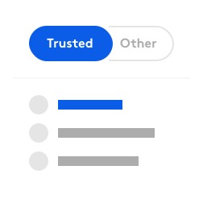

# Mailio Concepts

## End-to-End Encryption

{: .center}

If you choose to use end-to-end encryption be aware that this will work only within `Mailio ecosystem`. This is the default mode when sending from `@mail.io` address to another `@mail.io` address. 

!!! info "Summary"
    Sending and receiving emails that end with `@mail.io` are end-to-end encrypted and readable only by you and your counterparty. Not even we can read your emails since we don't have any of your credentials/keys. 

!!! error "SMTP protocol"
    Communication with other email providers is conducted over SMTP protocol. Emails transmitted using SMTP protocol may or may not be encrypted while in transit and are usually in a human readable format upon arrival.

## Cryptographic handshakes

{: .center}

Cryptographic handshakes is a tool built for you to control the rules of communication. You can choose that someones emails are important to you. If those emails become of no importance after a while use Cryptographic handshakes to mark that in our system. 

## VIP introductions

{: .center}

VIP introductions is email control on steroids. 

There is no way anyone can crawl into your `Trusted inbox` without you screening it first. 

Mailio automatically notifies any new sender that your email inbox is protected against email pollution and you might not see it unless they make a formal introduction. 

Upon their introduction they need to prove they're human. Then, only when approved by you, their emails can reach your `Trusted inbox`. 

!!! info "How to understant VIP introductions"
    Think of your email address as if it was a house. Before anyone can enter your house they need to ring a bell and say who they are. Then, only if you choose so, they'll be let in. Otherwise they can drop off their things at the front door and scaddoodle away.