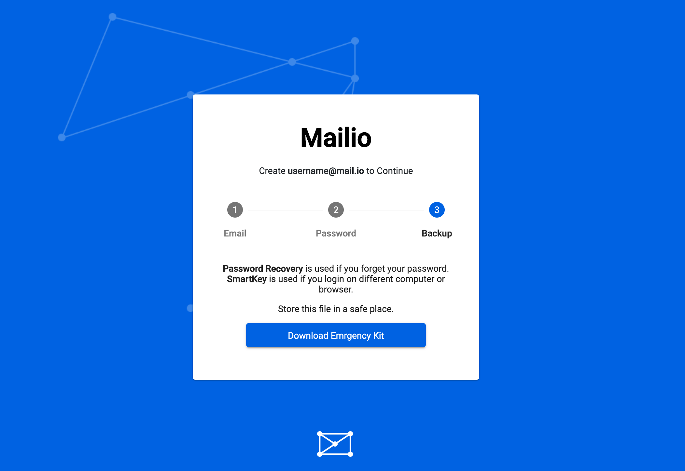

# Mailio Emergency Kit



Mailio Emergency Kit are two files in one compressed together in a single ZIP file. It's usually called `MailioSmartKey_youralias.zip`.

!!! error "Important"
    Make sure you don't loose your `Mailio Emergency Kit`. Due to the nature of Mailio security we can't help you recover your email account under any circumstances if you loose it. It's recommended you read `How to safely backup your Mailio Emergency Kit`.

One of the main ideas beind Mailio platform is privacy and control over email exchange. So we designed it in a way that even we can't see your emails or any type of credentials to access those emails.

!!! info
    The above sentence if true only if both communication parties are on the Mailio platform. 

## The contents of Mailio Emergency Kit

The `ZIP` file contains 2 files:

1. `recovery_youremailalias.pdf`
2. `smartkey_youremailalias.json`

### Mailio SmartKey

Mailio SmartKey is the `heart and soul of Mailio`. 
The SmartKey is encrypted with the password you choose upon registration. Therefore it's recommended to choose a **strong password** despite the fact that your password is never transmitted over the network. (There is an exception to this rule in case you enable email/password login)

```json
{
	"smartKey": "6wA3vSVOzpI....."
}
```

Mailio SmartKey contains:

- your email address
- your public and private keys

Private keys are mainly used to sign things (such as Handshakes for instance) and encrypt AES256 encryption keys which then encrypt your emails on Mailio platform. Public keys are used in email exchange inside `Mailio platform`. 


### Recovery PDF

The recovery PDF consists of 24 backup words. Those words define your private and derrived public keys. 

The Recovey PDF's sole purpose is a password recovery in case you forget your `password` that unlocks your `Mailio SmartKey`. 

!!! warning "Important"
    If you forget your password this is the only way to recoved your `Mailio SmartKey`. Keep this document safe and don't let anyone see it except you! Please read `How to safely store your Mailio Emergency Kit`.

### Changing your password

If you feel you haven't created strong enough password you can change it by visiting [Mailio Recovery](https://mail.io/recovery). Insert all 24 backup words (sometimes referred to as `backup mnemonics`), then change your password. 

## How to safely backup your Mailio Emergency Kit

!!! warning "Backup"
    It's very important not to loose your `Mailio Emergency Kit`. We strongly recommend you follow these instructions.

### Do not keep it on your computer

Ideally you won't have a copy of Mailio Emergency Kit on your computer. Even if you chose a very strong password that protects your Mailio SmartKey, `recovery_youremailalias.pdf` file within Mailio emergency Kit contains backup words that stay unprotected since they're readable by anyone with access to your `PDF` backup mnemonics file. 

### Make a copy on USB Flash drive or External Hard Drive

This way you protect your Mailio Emergency Kit from potential computer hardware failure and at the same time provide a so called `Cold storage`. Cold storage is referred to as storage which is not accessed frequently. The alternative to digital cold storage is paper. You can print your `recovery_youremailalias.pdf` on a piece of paper and keep it somewhere safe.

### Backup your Emergency Kit onto a secure cloud provider

Using a `zero knowledge` secure alternative cloud provider such as [SecureSafe](https://www.securesafe.com/) which offers free storage up to 100MB. 

### Create a strong password

This might be self-evident nowadays. If you have a hard time remembering passwords store it onto a secure cloud provider. But then again, you shouldn't forget that password.
